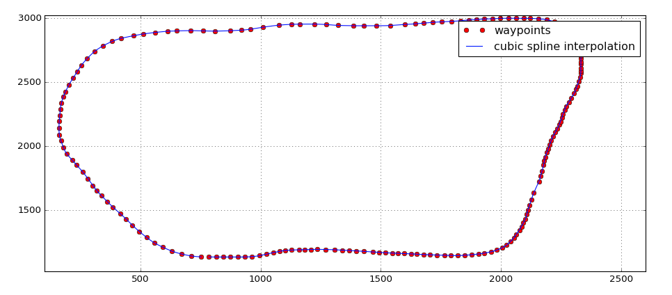

# Pathplanning project


## Goals
In this project the goal is to safely navigate safely around a virtual three lane highway with other traffic that is driving with a speed close to the maximum 50 MPH speed limit around the track while avoiding collisions and other traffic incidents. The car's sensor fusion provides the state of the ego vehicle as well as the state of the other surrounding vehicles, also there is a sparse map list of waypoints around the highway. The car should try to go as close as possible to the 50 MPH speed limit, which means passing slower traffic when possible, note that other cars will try to change lanes too. The car should avoid hitting other cars at all cost as well as driving inside of the marked road lanes at all times, unless going from one lane to another. The car should be able to make one complete loop around the 6946m highway. Since the car is trying to go 50 MPH, it should take a little over 5 minutes to complete 1 loop. Also the car should not experience total acceleration over 10 m/s^2 and jerk that is greater than 10 m/s^3 which captures the notion of a physically safe and comfortable car ride.

## Implementation
### State machine
A finite state machine with transitions based on cost-functions is used to find the most convenient and safe path according to the objective of repeatedly driving around the test track without causing traffic incidents. The way the car responds to certain situation can be configured by cost-function weights, e.g. the penalty for staying a slow lane or high accelerations or frequent lane changes. Having multiple trajectory variations modelled into only one state and using cost-functions as transition condition is convenient because it keeps the state machine simple and clear and makes it easy to add more cost policies, without altering the structure of the state machine.

The following states are used:
* go straight
* follow vehicle
* lane change left
* lane change right
Based on the current situation possible transitions to future states are activated or deactivated.
Trajectories for all possible future states are then generated with default values which get further perturbed to add potentially more cost-efficient variations.
Eventually these trajectories are evaluated for feasibility (no collisions, does not exceed acceleration and jerk limit, etc). Non-feasible trajectories are marked with a very high cost, such that only feasible trajectories are compared against each other with the "cheapest" trajectory becoming the output of the path planner. All trajectories are weighted according to preferences reflected in the weights.
It was difficult to find accurate start car states (especially velocities and accelerations) for generating feasible trajectories. Therefore a history of previously planned car states is kept in the trajectory object within the planner for consecutive planning steps.
Because it’s convenient path planning was done in frenet coordinates which later get converted into world X/Y coordinates by the map object.

### Cost functions
Inspired by the extensive python example in the lecture the following cost functions have been implemented in C++:
```
    double traffic_buffer_cost(const pair<Polynomial, Polynomial> &traj,
                               const vector<double> &goal, const vector<Vehicle> &vehicles);
    double efficiency_cost(const pair<Polynomial, Polynomial> &traj,
                           const vector<double> &goal, const vector<Vehicle> &vehicles);
    double total_accel_d_cost(const pair<Polynomial, Polynomial> &traj,
                              const vector<double> &goal, const vector<Vehicle> &vehicles);
    double total_accel_s_cost(const pair<Polynomial, Polynomial> &traj,
                              const vector<double> &goal, const vector<Vehicle> &vehicles);
    double total_jerk_cost(const pair<Polynomial, Polynomial> &traj,
                           const vector<double> &goal, const vector<Vehicle> &vehicles);
    double lane_depart_cost(const pair<Polynomial, Polynomial> &traj,
                            const vector<double> &goal, const vector<Vehicle> &vehicles);
    double traffic_ahead_cost(const pair<Polynomial, Polynomial> &traj,
                              const vector<double> &goal, const vector<Vehicle> &vehicles);
```

### Jerk minimal trajectories
The resulting jerk minimal trajectories are modelled using quintic (5th order) polynomials. Using quintic polynomials for describing sequential displacements has the advantage that by differentiating the displacement polynomial the acceleration as well as jerk are smooth and therefore don't have discontinuities across a path. Boundary conditions (displacement, velocity, acceleration, time-duration) for the start and end of a path are defined, such that we end up with three equations for final displacement, velocity and acceleration and three unknowns, which is a straightforward problem to solve.

TODO: Equations!

Because we are not using classical optimization of a trajectory over several constraints, similarily to the [MPC project](https://github.com/da-phil/SDC-Model-Predictive-Control), we pertubate the intial boundary condition parameters from the state machine by sampling from a distribution to be able to capture more cost-optimal trajectories.

### Waypoints and smooth paths
Because of the coarse and discrete nature of the track waypoints, a smooth function has to be fitted to the coordinates of the map. Compared to polynomials, splines have the advantage that the fitted spline function goes through all fitted points, therefore cubic splines have been used.
As a really helpful resource for fitting cubic splines I was using the [open-source spline library from Tino
Kluge](http://kluge.in-chemnitz.de/opensource/spline), which comes in a single hearder file and is really easy to use.

The following plot shows the track waypoints and a cubic spline fitted to them:


In this project all track waypoints are provided at once in a .csv File. It would be possible to use the entire world at once to fit a spline through all waypoints, but it is not possible nor practical in reality. Moreover, it would have required special treatment to ensure a smooth transition when the S coordinate of the track wraps around back to 0 when one lap was completed.
Instead, a local area with the 30 closest waypoints to the car is used and splines for X, Y, dX and dY in respect to S are fitted, which also makes the conversion from frenet to cartesian space smooth and jerk-minimal.

### Dealing with lag
Since the vehicle "teleports" around the track based on an exact X/Y coordinate, it is very susceptible to small discontinuities in the planned path, this gets amplified by lag between the simulator and path planner. On my PC the lag is between one and four cycles at the simulator sample rate of 0.02 seconds.

To overcome discontinuities at each update interval the following steps are done:
* reuse a defined amount of previous path elements for consecutive planning steps
* for each successive point, deltas in X and Y between the planning steps of the new path are added on top of the previous X and Y value. This adds a neglibible error of no more than the distance the car travels in one timestep (0.02s).

### Covered corner cases

#### Emergency brake

In very rare occasions vehicles make aggressive lane changes and cut off our vehicle.
In order to avoid a sudden collision emergency brake mode is activated and a hard braking maneuver is enforced. This prioritizes avoiding collisions over staying within comfort limits (acceleration and jerk) and therefore most likely causes an incident in the simulator. This high deceleration force is achieved by shortening the path update intervals and disables lane changes.
It ignores comfort limits for decceleration force, shortens path update intervals and disallows lane changes (which are dangerous combined with the hard braking).

#### Car gets stuck in slow traffic

Sometimes when the car drives on one of the outside lanes it gets stuck behind slow traffic when the neighboring middle lane has equally slow traffic and gives a high cost to a lane change, even though the opposite lane is free.
Identifying this situation and lowering the cost of the lane change to the middle lane solved this problem to "encourage" the car to make its way to the free lane.

## Code structure
### main.cpp
Interface code to simulator
### trackmap.cpp
Map functionaliy, using cubic splines to generate smooth paths in X/Y or frenet S/D coordinates
### vehicle.cpp
Class which stores kinematic values of a vehicle, instances of this class are used in the Trajectory class
### polynomials.cpp
General purpose helper class for using polynomials and their first and second derivative.
### trajectoryGenerator.cpp
Trajectory generator which implements the state machine and cost functions, it also contains a Trajectory helper class which instantiates Vehicle objects for every time instance.

## Results
Here is a video of approx. 1.5x cycles around the highway track:

[imgs/video2.mkv](imgs/video2.mp4)

## Future work / TODO

Because this project was already taking up quite a lot of time to bring it to a satifying result, here I give an outlook on further possible improvements:
* Implement behaviour prediction for other cars using model based or data-driven (machine learning) approaches such as provided in the lectures, in order to allow the system to respond smarter to the surrounding traffic and to avoid very rare collision incidents which are hardly avoidable with the current, simple approach.
* Improve path planning in situations where the car gets stuck even more by a more sophisticated method.
* Improve the emergency braking and test it more, because it's needed only such rare cases that it's impossible to test and deubg
    
## Running the code

### Dependencies
* cmake >= 3.5
  * All OSes: [click here for installation instructions](https://cmake.org/install/)
* make >= 4.1
  * Linux: make is installed by default on most Linux distros
  * Mac: [install Xcode command line tools to get make](https://developer.apple.com/xcode/features/)
  * Windows: [Click here for installation instructions](http://gnuwin32.sourceforge.net/packages/make.htm)
* gcc/g++ >= 5.4
  * Linux: gcc / g++ is installed by default on most Linux distros
  * Mac: same deal as make - [install Xcode command line tools]((https://developer.apple.com/xcode/features/)
  * Windows: recommend using [MinGW](http://www.mingw.org/)
* [uWebSockets](https://github.com/uWebSockets/uWebSockets)
  * Run either `install-mac.sh` or `install-ubuntu.sh`.
  * If you install from source, checkout to commit `e94b6e1`, i.e.
    ```
    git clone https://github.com/uWebSockets/uWebSockets 
    cd uWebSockets
    git checkout e94b6e1
    ```

### Basic build instructions
1. Clone this repo.
2. Make a build directory: `mkdir build && cd build`
3. Compile: `cmake .. && make`
4. Run it: `./path_planning`.


### Simulator
#### Get the simulator
You can download the Term3 Simulator which contains the Path Planning Project from the [releases tab (https://github.com/udacity/self-driving-car-sim/releases/tag/T3_v1.2).

#### Simulator implementation details
1. The car uses a perfect controller and will visit every (x,y) point it recieves in the list every 0.02 seconds. The units for the (x,y) points are in meters and the spacing of the points determines the speed of the car. The vector going from a point to the next point in the list dictates the angle of the car. Acceleration both in the tangential and normal directions is measured along with the jerk, the rate of change of total Acceleration. The (x,y) point paths that the planner recieves should not have a total acceleration that goes over 10 m/s^2, also the jerk should not go over 10 m/s^3.

2. There will be some latency between the simulator running and the path planner returning a path, with optimized code usually its not very long maybe just 1-3 time steps. During this delay the simulator will continue using points that it was last given, because of this its a good idea to store the last points you have used so you can have a smooth transition. previous_path_x, and previous_path_y can be helpful for this transition since they show the last points given to the simulator controller with the processed points already removed. You would either return a path that extends this previous path or make sure to create a new path that has a smooth transition with this last path.

#### The highway map
The waypoints for the highway map is stored in [data/highway_map.csv](data/highway_map.csv).
Each waypoint in the list contains `x, y, s, dx, dy` values. `x` and `y` are the waypoint's map coordinate position, the `s` value is the distance along the road to get to that waypoint in meters, the `dx` and `dy` values define the unit normal vector pointing outward of the highway loop.

The highway's waypoints loop around so the frenet s value, distance along the road, goes from 0 to 6945.554.

Here is the data provided from the Simulator to the C++ Program

#### Simulator output

##### Main car's localization Data (No Noise)

`x` The car's x position in map coordinates

`y` The car's y position in map coordinates

`s` The car's s position in frenet coordinates

`d` The car's d position in frenet coordinates

`yaw` The car's yaw angle in the map

`speed` The car's speed in MPH

##### Previous path data given to the Planner

__Note__: Return the previous list but with processed points removed, can be a nice tool to show how far along
the path has processed since last time. 

`previous_path_x` The previous list of x points previously given to the simulator

`previous_path_y` The previous list of y points previously given to the simulator

##### Previous path's end s and d values 

`end_path_s` The previous list's last point's frenet s value

`end_path_d` The previous list's last point's frenet d value

##### Sensor Fusion Data, a list of all other car's attributes on the same side of the road. (No Noise)

`sensor_fusion` A 2d vector of cars and then that car's car's unique ID, car's x position in map coordinates, car's y position in map coordinates, car's x velocity in m/s, car's y velocity in m/s, car's s position in frenet coordinates, car's d position in frenet coordinates.
